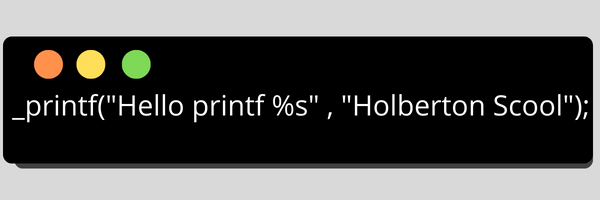

<h1 align="center">
	✏️ _printf
</h1>

<p align="center">
	<b><i>HOLBERTON SCHOOL PRINTF</i></b><br>
</p>
<p align="center">
	

</p>

<h3 align="center">
	<a href="#Description">About</a>
	<span> · </span>
	<a href="#Algorithm-and-logic-behind-this">Usage</a>
	<span> · </span>
	<a href="#Compilation-and-testing">Testing</a>
</h3>

---

## 💡 _printf:

In our First Holberton school group project pair programing we work on making our own `_printf`,
We make it From 0 to 100 by using VS CODE and VIM.

## 💡 Description: 

`_printf` is a custom implementation of the C programming function printf. Similar to the printf (3) - Prints formatted data to stdout

Printf() function is often used to our program to do formatted output. All variants of printf function use the same formatting techniques. There is a string that specifies the layouts of output is call format specifier.

## 📋  Function prototype
```{r mon_bloc, echo = FALSE, WARNING = TRUE}

int _printf(const char *format, ...);
```
where format can be a simple string without any specifiers or it can contain specifiers and the arguments corresponding to them.

## 📋  Implemented format specifiers

| Specifier:|	Output							|	Example			|
| :---------|:----------------------------------|-----------------:	|
|	c		|		Character					|		H			|
|	s		|		String						|		Hello		|
|	d		|		decimal integer				|		100			|	
|	i		|		Integer						|		100			|
|	%		|		% followed by another %		|		%			|
|	b		|		Binary						|		1010		|
|	u		|	Unsigned decimal int			|		100			|
|   o		|	Unsigned octal integer			|		1142		|
|	x		|	Unsigned Hzxadecimal (lowcase)	|		7fa			|
|	X		|	Unsigned Hexadecimal (uppercase)|		7FA			|
|	r		|	Reverse a string				|		olleh		|


>Check the [Man](https://github.com/HanaOuerghemmi/holbertonschool-printf/blob/main/man_3_printf) Page for detailed usage.

## 🛠️  Algorithm and logic behind this
* Check this flowchart explaining the functions flow


## 🛠️  Compilation and testing

#### We are compiling via:
```{r mon_bloc, echo = FALSE, WARNING = TRUE}
$ gcc -Wall -Werror -Wextra -pedantic *.c
```
### EXEMPLE
```
_printf("print d :%d\n", -762534);

```
`the output` : 

	print d : -762534


## 📋  What our file stand for:

* [Main.h](https://github.com/HanaOuerghemmi/holbertonschool-printf/blob/main/main.h) :The Header file
* [Get_function.c](https://github.com/HanaOuerghemmi/holbertonschool-printf/blob/main/get_function.c):  This file contains the functions to handle each argument type like (s, c, %, i, d).
* [Get_more_func.c](https://github.com/HanaOuerghemmi/holbertonschool-printf/blob/main/get_more_func.c) : This file contains the function to handle each argument type like (b,u, o, x, X)
* [even_func.c](https://github.com/HanaOuerghemmi/holbertonschool-printf/blob/main/even_func.c): This file contains the function to handle each argument type like (r, )
* [get_all.c](https://github.com/HanaOuerghemmi/holbertonschool-printf/blob/main/get_all.c) : this file containe the function how cheks function 
* [stdr_function.c](https://github.com/HanaOuerghemmi/holbertonschool-printf/blob/main/stdr_function.c) : This file contains the standard function (_putchar).


## 📋  Functions used:

* `write`
* `va_start` 
* `va_end` 
* `va_copy`
* `va_arg`
 
## Authors:
* [Hana Ouerghemmi](https://github.com/HanaOuerghemmi)
* [Aya Aribi](https://github.com/ayaaribi123)
 
